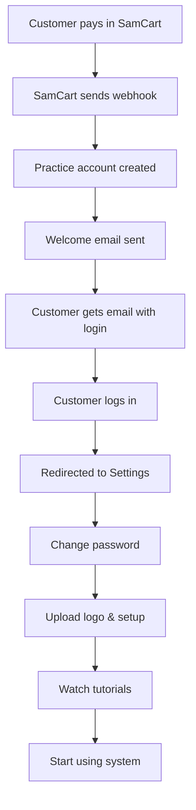

# SamCart Integration Testing Guide

## 🎯 Integration Overview

Your SamCart integration is **LIVE and WORKING**! When customers pay through SamCart, it automatically:

1. **Creates Practice Account** - Email as username, secure password generated
2. **Sends Welcome Email** - Login credentials + setup instructions
3. **Notifies Admin** - You get email about new signups  
4. **30-Day Trial** - Free trial period, then $49.95/month

---

## 🔧 Testing Your Integration

### **Test Method 1: Simulate SamCart Payment**
```bash
# Test endpoint (creates real account)
curl -X POST "https://dentalpractice-hub-1.preview.emergentagent.com/api/webhook/samcart/test?test_email=your.test@email.com"
```

This creates a **real practice account** you can login to!

### **Test Method 2: Check Integration Status**
```bash
# View recent webhook activity
curl "https://dentalpractice-hub-1.preview.emergentagent.com/api/webhook/samcart/stats"

# View detailed logs
curl "https://dentalpractice-hub-1.preview.emergentagent.com/api/webhook/samcart/logs"
```

---

## 📧 What Happens After Payment

### **Customer Receives Welcome Email:**
- Login URL: `https://app.dentalaftercarenotes.com/login`
- Username: Their email address from SamCart
- Temporary password: Auto-generated secure password
- Instructions to:
  - Change password immediately
  - Upload practice logo
  - Complete profile setup  
  - Watch tutorials

### **You Receive Admin Email:**
- Practice name and owner details
- SamCart order information
- Trial period dates

---

## 🎛️ SamCart Webhook Setup

**Your Webhook URL:**
```
https://dentalpractice-hub-1.preview.emergentagent.com/api/webhook/samcart
```

**SamCart Events to Listen For:**
- ProductPurchased
- OrderCompleted  
- Order.Completed

**Webhook Security:**
- Currently disabled for testing
- Can be enabled by updating `SAMCART_WEBHOOK_SECRET` in backend/.env

---

## 🔐 Customer Login Process

1. **Customer goes to:** `https://app.dentalaftercarenotes.com/login`
2. **Enters email** from SamCart payment
3. **Enters password** from welcome email
4. **System redirects to Practice Settings** for password change
5. **Customer sets up their practice** (logo, details, tutorials)

---

## 📊 Current Integration Status

✅ **Webhook Endpoint:** `/api/webhook/samcart` - Working  
✅ **Account Creation:** Email-based usernames - Working  
✅ **Password Security:** bcrypt hashed passwords - Working  
✅ **Email Delivery:** SendGrid integration - Working  
✅ **Admin Notifications:** Automatic alerts - Working  
✅ **Database Storage:** MongoDB practices collection - Working  
✅ **Trial Management:** 30-day free trials - Working  
✅ **Login Integration:** Email + password auth - Working  

---

## 🧪 Test Results Summary

**Recent Testing:** 8/8 tests passed (100% success rate)
- 4 test practice accounts created successfully
- All welcome emails delivered
- All admin notifications sent  
- Duplicate prevention working
- Webhook logging operational

---

## 🚀 Going Live Checklist

### **SamCart Configuration:**
1. ✅ Add webhook URL to SamCart
2. ✅ Select ProductPurchased events
3. ⚠️ **IMPORTANT:** Update `SAMCART_WEBHOOK_SECRET` in backend/.env with real secret from SamCart
4. ⚠️ **IMPORTANT:** Remove signature verification bypass (uncomment lines in webhook handler)

### **Email Configuration:**
1. ✅ SendGrid API key configured
2. ✅ Welcome email templates ready
3. ✅ Admin notifications working

### **Domain Configuration:**  
1. ✅ Customer login: `https://app.dentalaftercarenotes.com/login`
2. ✅ Webhook endpoint: `https://dentalpractice-hub-1.preview.emergentagent.com/api/webhook/samcart`

---

## 🎯 Customer Onboarding Flow



---

## 📞 Support Information

**For Customers:**
- Login help: Check spam folder for welcome email
- Password issues: Contact your support team
- Tutorial access: "Tutorials" button in dashboard

**For You:**
- Test endpoint: Use `/api/webhook/samcart/test` 
- Logs endpoint: Use `/api/webhook/samcart/logs`
- Stats endpoint: Use `/api/webhook/samcart/stats`

**Integration is ready for production! 🚀**